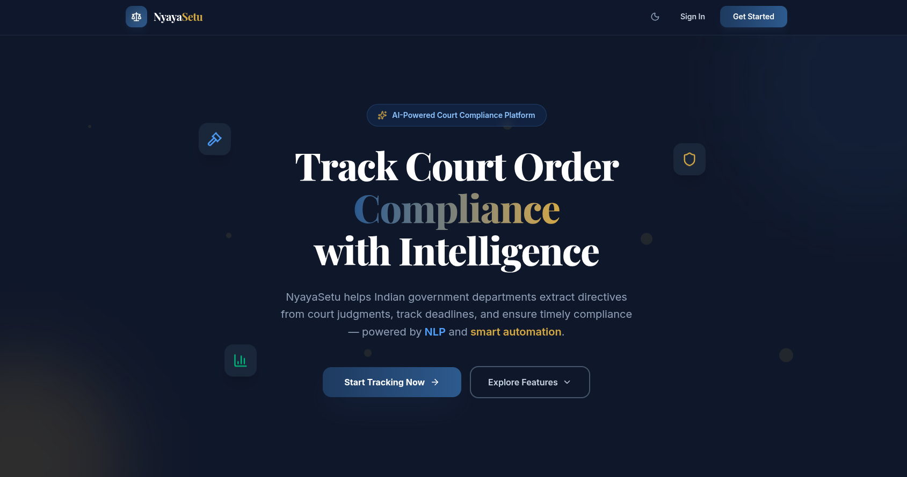
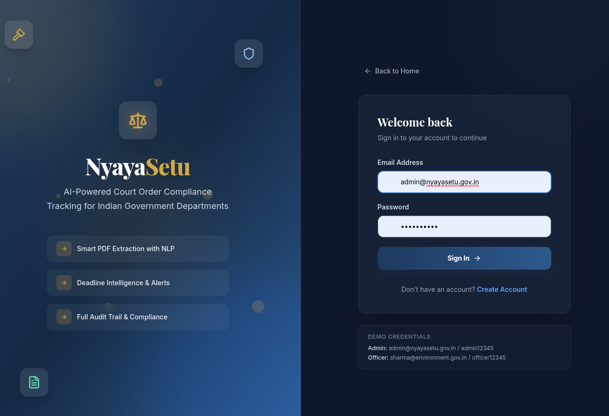
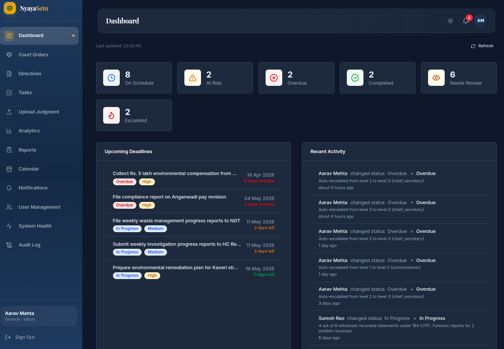
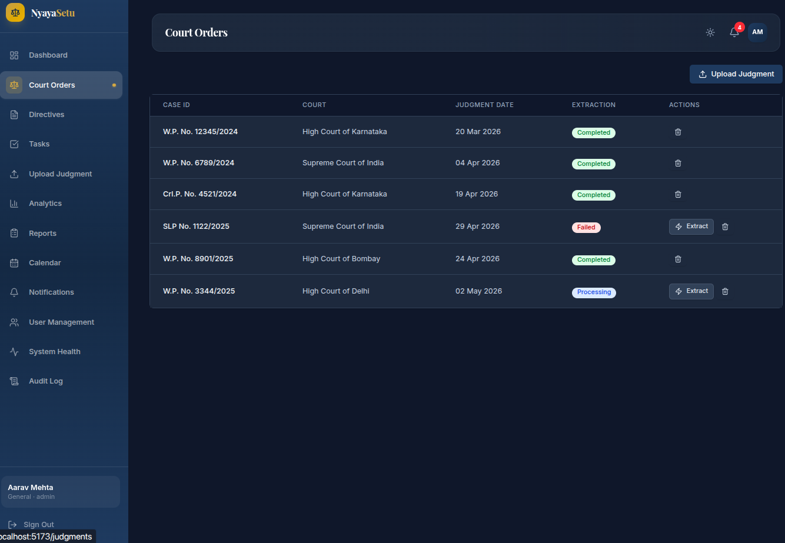
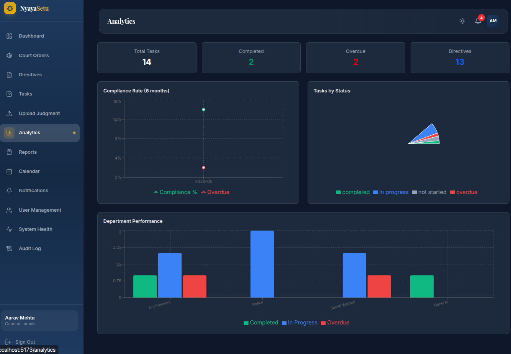
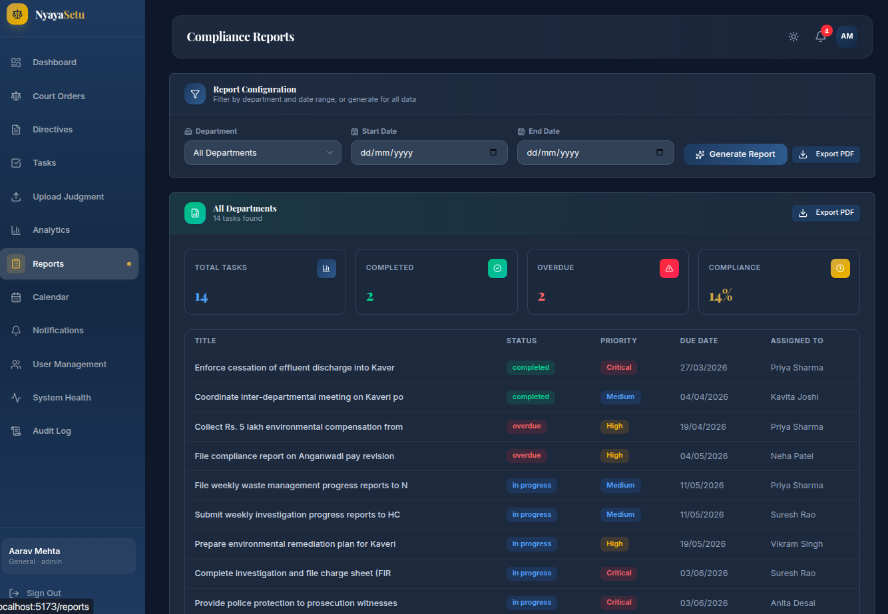
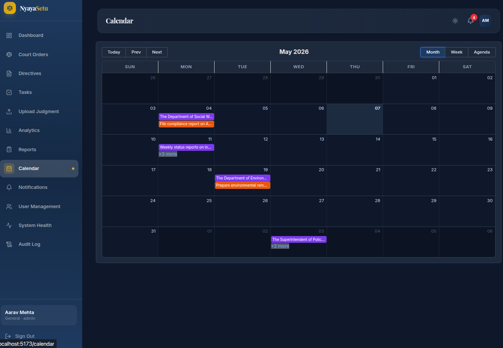

<div align="center">

# ⚖️ NyayaSetu

### AI-Powered Court Order Compliance Tracking Dashboard

*Bridging the gap between court orders and government compliance — powered by NLP and smart automation*

[](https://nodejs.org/)
[](https://python.org/)
[](https://react.dev/)
[](https://mongodb.com/)
[](https://docker.com/)
[](#-running-tests)
[](LICENSE)
[](https://nyaya-setu-liart.vercel.app/)

<br />



</div>

---

## 📋 Table of Contents

- [🎯 Problem Statement](#-problem-statement)
- [💡 Our Solution](#-our-solution)
- [🖥️ Screenshots](#️-screenshots)
- [✨ Features](#-features)
- [🏗️ Architecture](#️-architecture)
- [🛠️ Tech Stack](#️-tech-stack)
- [🚀 Getting Started](#-getting-started)
- [📂 Project Structure](#-project-structure)
- [🔌 API Reference](#-api-reference)
- [🧪 Running Tests](#-running-tests)
- [🤖 NLP Pipeline Demo](#-nlp-pipeline-demo)
- [👥 User Roles & Permissions](#-user-roles--permissions)
- [📊 Key Metrics](#-key-metrics)
- [🗺️ Roadmap](#️-roadmap)
- [🤝 Contributing](#-contributing)

---

## 🎯 Problem Statement

> **Thousands of court orders go unexecuted in India annually — not due to inability, but due to tracking failures.**

Government departments miss court-mandated compliance deadlines because:
- 📄 Court judgments arrive as PDFs via email and pile up untracked
- ⏰ No centralized system exists to track deadlines across departments
- 🔍 Manual extraction of directives from 50+ page judgments is error-prone
- 📉 Departments face **contempt of court proceedings** due to missed deadlines
- 📋 No audit trail to prove compliance efforts to the judiciary

### Who Suffers?

| Stakeholder | Pain Point |
|:---|:---|
| **Chief Secretary** | No single view of pending court orders across all departments |
| **Departments** | Don't know what court order tasks they owe or when they're due |
| **Courts** | No proof that orders are being tracked or executed |
| **Citizens** | Government policies and court-ordered reforms get delayed indefinitely |

---

## 💡 Our Solution

**NyayaSetu** (*Nyaya = Justice, Setu = Bridge*) is an AI-powered platform that automatically reads court judgment PDFs, extracts actionable directives and deadlines using NLP, and provides a real-time compliance tracking dashboard for government departments.

### How It Works — 5 Simple Steps

```
┌─────────────┐    ┌──────────────┐    ┌────────────────┐    ┌───────────────┐    ┌──────────────┐
│  📄 Upload  │───▶│  🤖 AI       │───▶│  📋 Auto-      │───▶│  📊 Live      │───▶│  ✅ Proof of │
│  Judgment   │    │  Extracts    │    │  Create Tasks  │    │  Dashboard    │    │  Compliance  │
│  PDF        │    │  Directives  │    │  & Deadlines   │    │  & Alerts     │    │  Audit Trail │
└─────────────┘    └──────────────┘    └────────────────┘    └───────────────┘    └──────────────┘
```

### Real-World Example

> **High Court orders:** *"Department of Environment must submit remediation plan within 60 days"*

| Step | What NyayaSetu Does |
|:---|:---|
| **Extract** | Identifies: `"Remediation plan"` · `"60 days"` · `"Environment Dept"` |
| **Task** | Creates task for Dr. Sharma (Environment Commissioner) |
| **Deadline** | Sets due date: June 15, 2026 |
| **Alert** | Sends reminder on May 31 (15 days left) |
| **Track** | Logs progress: Survey complete → Report drafted → Ready for submission |
| **Report** | Generates court-ready compliance certificate |

### Before vs After

| | Before NyayaSetu | After NyayaSetu |
|:---|:---|:---|
| **Tracking** | Scattered emails, Excel sheets | Centralized dashboard |
| **Extraction** | Manual reading of 50+ page PDFs | AI extracts in seconds |
| **Deadlines** | Frequently missed | Zero missed (with alerts) |
| **Audit** | No proof of compliance efforts | Complete immutable audit trail |
| **Escalation** | Manual follow-ups | Auto-escalation hierarchy |

---

## 🖥️ Screenshots

<details>
<summary><b>🏠 Landing Page</b> — Premium homepage with feature highlights</summary>
<br />


</details>

<details>
<summary><b>🔐 Login Page</b> — Secure authentication with demo credentials</summary>
<br />



</details>

<details>
<summary><b>📊 Dashboard</b> — Real-time compliance overview with status cards & deadlines</summary>
<br />



</details>

<details>
<summary><b>⚖️ Court Orders</b> — Manage uploaded judgments with extraction status</summary>
<br />



</details>

<details>
<summary><b>📈 Analytics</b> — Compliance rate trends, task distribution & department performance</summary>
<br />



</details>

<details>
<summary><b>📝 Reports</b> — Generate & export compliance reports as PDF</summary>
<br />



</details>

<details>
<summary><b>📅 Calendar</b> — Monthly/weekly view of all deadlines</summary>
<br />



</details>

---

## ✨ Features

### 🤖 AI & NLP Engine
| Feature | Description |
|:---|:---|
| **PDF Text Extraction** | Handles both digital and scanned PDFs (PyPDF2 + Tesseract OCR) |
| **Named Entity Recognition** | spaCy NER identifies courts, departments, officers, legal sections |
| **Directive Extraction** | Pattern matching + NLP to identify actionable orders from judgment text |
| **Deadline Resolution** | Converts relative dates ("within 60 days", "by next Monday") to absolute dates |
| **Confidence Scoring** | Each extracted directive has a confidence score (avg 0.92 on sample data) |
| **Legal Section Detection** | Auto-detects referenced IPC/CrPC/CPC sections |

### 📋 Compliance Management
| Feature | Description |
|:---|:---|
| **Task Lifecycle** | Create → Assign → In Progress → Review → Complete with full status tracking |
| **Smart Alerts** | Hourly deadline checks via `node-cron`, alerts at 10/5/1 day thresholds |
| **Auto-Escalation** | Overdue tasks escalate through: Officer → Commissioner → Chief Secretary |
| **Priority Levels** | Critical / High / Medium / Low with color-coded badges |
| **Bulk Upload** | Upload multiple judgment PDFs at once for batch processing |
| **Extraction Queue** | Sequential in-memory queue prevents NLP service overload |

### 📊 Dashboard & Analytics
| Feature | Description |
|:---|:---|
| **Real-Time Overview** | Status cards: On Schedule / At Risk / Overdue / Completed / Escalated |
| **Compliance Rate Charts** | 6-month trend line with Recharts interactive graphs |
| **Department Performance** | Bar charts comparing completion rates across departments |
| **Task Distribution** | Pie chart of tasks by status |
| **Calendar View** | Monthly/weekly/agenda views with color-coded deadline events |
| **PDF Reports** | Export compliance reports with jsPDF + auto-table formatting |

### 🔒 Security & Administration
| Feature | Description |
|:---|:---|
| **JWT Authentication** | Access token (7d) + refresh token (30d) rotation |
| **Role-Based Access** | Admin, Department Head, Officer with scoped permissions |
| **Rate Limiting** | API rate limiting with `express-rate-limit` |
| **Audit Trail** | Immutable log of every CUD operation (admin-only view) |
| **Helmet Security** | HTTP security headers via `helmet` |
| **Input Validation** | All inputs validated with `express-validator` |

### 🎨 User Experience
| Feature | Description |
|:---|:---|
| **Dark Mode** | Full dark theme support via ThemeContext |
| **Notification Bell** | Real-time unread count with mark-as-read |
| **Collaborative Comments** | Thread-based comments with @mentions on tasks/judgments |
| **Lazy Loading** | Code-split routes (304KB initial bundle) for fast load times |
| **Responsive Design** | Tailwind CSS v4 responsive layout |
| **Drag & Drop Upload** | Intuitive file upload with `react-dropzone` |

---

## 🏗️ Architecture

```
┌──────────────────────────────────────────────────────────────────────┐
│                          NGINX (Port 80)                            │
│                     Reverse Proxy + Static Files                     │
└───────────────┬──────────────────────────────────┬───────────────────┘
                │                                  │
                ▼                                  ▼
┌───────────────────────────┐    ┌─────────────────────────────────────┐
│     React Frontend        │    │         Node.js API (Port 5000)     │
│     (Vite + Tailwind v4)  │    │         Express 5 + Mongoose 9      │
│                           │    │                                     │
│  • 18 Pages (lazy-loaded) │    │  • 12 Route Groups + Swagger Docs   │
│  • 42 Components          │    │  • JWT Auth + RBAC Middleware        │
│  • Axios API Client       │    │  • File Upload (Multer, 10MB max)   │
│  • Recharts + jsPDF       │    │  • Alert Scheduler (node-cron)      │
│  • react-big-calendar     │    │  • Extraction Queue                 │
│  • Dark Mode Support      │    │  • Audit Logger Middleware           │
└───────────────────────────┘    └──────────────┬──────────────────────┘
                                                │
                              ┌─────────────────┼──────────────────┐
                              │                 │                  │
                              ▼                 ▼                  ▼
               ┌──────────────────┐  ┌──────────────┐  ┌──────────────────┐
               │   MongoDB 7      │  │  Python NLP  │  │  Tesseract OCR   │
               │                  │  │  FastAPI     │  │                  │
               │  8 Collections:  │  │  Port 8001   │  │  PDF → Text      │
               │  • User          │  │              │  │  (Scanned docs)  │
               │  • Judgment      │  │  • spaCy NER │  └──────────────────┘
               │  • Directive     │  │  • PyPDF2    │
               │  • Task          │  │  • Regex     │
               │  • StatusUpdate  │  │  • Deadline  │
               │  • Notification  │  │    Resolver  │
               │  • AuditLog      │  │  • Section   │
               │  • Comment       │  │    Detector  │
               └──────────────────┘  └──────────────┘
```

### Data Flow

```
PDF Upload → Text Extraction (PyPDF2/OCR) → NLP Processing (spaCy NER)
    → Directive Extraction (patterns) → Deadline Resolution (date parsing)
        → Task Creation → Alert Scheduling → Dashboard Display
```

---

## 🛠️ Tech Stack

| Layer | Technology | Purpose |
|:---|:---|:---|
| **Frontend** | React 19, Vite 8, Tailwind CSS v4 | SPA with lazy-loaded routes |
| **Charts** | Recharts 3 | Interactive analytics visualizations |
| **PDF Export** | jsPDF + jspdf-autotable | Client-side compliance report generation |
| **Calendar** | react-big-calendar | Monthly/weekly deadline calendar |
| **Icons** | Lucide React | Consistent icon system |
| **Backend API** | Node.js, Express 5, Mongoose 9 | REST API with JWT auth |
| **NLP Service** | Python 3.10, FastAPI | PDF extraction microservice |
| **NLP Models** | spaCy (en_core_web_sm) | Named Entity Recognition |
| **OCR** | Tesseract, PyPDF2 | Text extraction from scanned PDFs |
| **Database** | MongoDB 7 | Document store (8 indexed collections) |
| **Auth** | JWT + bcryptjs | Token rotation with role-based access |
| **Scheduling** | node-cron | Hourly deadline check & alert dispatch |
| **Email** | Nodemailer | Deadline alert notifications |
| **API Docs** | Swagger/OpenAPI | Interactive endpoint documentation |
| **Testing** | Jest + supertest, pytest | 74 automated tests |
| **DevOps** | Docker Compose, Nginx | One-command deployment |

---

## 🚀 Getting Started

### Prerequisites

| Requirement | Version | Installation |
|:---|:---|:---|
| Node.js | 18+ | [nodejs.org](https://nodejs.org/) |
| Python | 3.10+ | [python.org](https://python.org/) |
| MongoDB | 7+ | [mongodb.com](https://mongodb.com/) or use Docker |
| Tesseract OCR | Latest | `sudo apt install tesseract-ocr` |

---

### 🌐 Live Demo

> **Try it now:** https://nyaya-setu-liart.vercel.app/
>
> | Role | Email | Password |
> |:---|:---|:---|
> | Admin | `admin@nyayasetu.gov.in` | `admin12345` |
> | Officer | `sharma@environment.gov.in` | `officer12345` |

---

### ⚡ Option 1: Docker (Recommended — One Command)

```bash
# Clone the repository
git clone https://github.com/AakashShah07/NyayaSetu.git
cd NyayaSetu

# Start all services
docker-compose up --build
```

| Service | URL |
|:---|:---|
| 🌐 Frontend | http://localhost |
| 🔗 API | http://localhost:5000 |
| 📚 API Docs (Swagger) | http://localhost:5000/api/docs |
| 🤖 NLP Service | http://localhost:8001 |

---

### 🔧 Option 2: Local Development

You need **3 terminals** running simultaneously.

<details>
<summary><b>Terminal 1 — Node.js API</b></summary>

```bash
cd backend/node-api

# Configure environment
cp .env.example .env
# Edit .env with your MongoDB URI, JWT secret, etc.

# Install dependencies & start
npm install
npm run dev
```

✅ API running at http://localhost:5000

</details>

<details>
<summary><b>Terminal 2 — Python NLP Service</b></summary>

```bash
cd backend/python-nlp

# Create virtual environment
python3 -m venv .venv
source .venv/bin/activate

# Install dependencies
pip install -r requirements.txt

# Install spaCy language model
pip install https://github.com/explosion/spacy-models/releases/download/en_core_web_sm-3.7.1/en_core_web_sm-3.7.1-py3-none-any.whl

# Start NLP service
uvicorn app.main:app --reload --port 8001
```

✅ NLP service running at http://localhost:8001

</details>

<details>
<summary><b>Terminal 3 — React Frontend</b></summary>

```bash
cd frontend

# Install dependencies & start
npm install
npm run dev
```

✅ Frontend running at http://localhost:5173

</details>

---

### 🌱 Seed the Database

Populate with sample users, judgments, directives, and tasks:

```bash
cd backend/node-api
node scripts/seed.js
```

To reset and re-seed:
```bash
node scripts/seed.js --reset
```

---

### 🔑 Test Credentials

| Role | Email | Password |
|:---|:---|:---|
| 🔴 Admin | `admin@nyayasetu.gov.in` | `admin12345` |
| 🟢 Officer | `sharma@environment.gov.in` | `officer12345` |

---

### ⚙️ Environment Variables

<details>
<summary><b>Click to view all environment variables</b></summary>

Create a `.env` file in `backend/node-api/`:

```bash
cp backend/node-api/.env.example backend/node-api/.env
```

| Variable | Default | Description |
|:---|:---|:---|
| `PORT` | `5000` | API server port |
| `MONGODB_URI` | `mongodb://localhost:27017/nyayasetu` | MongoDB connection string |
| `JWT_SECRET` | — | Secret key for JWT signing |
| `JWT_EXPIRES_IN` | `7d` | Access token expiry |
| `JWT_REFRESH_EXPIRES_IN` | `30d` | Refresh token expiry |
| `NLP_SERVICE_URL` | `http://localhost:8001` | Python NLP service URL |
| `UPLOAD_DIR` | `./uploads` | PDF upload directory |
| `MAX_FILE_SIZE_MB` | `10` | Max upload file size |
| `NODE_ENV` | `development` | Environment mode |
| `CORS_ORIGINS` | `http://localhost:5173` | Allowed CORS origins |

</details>

---

## 📂 Project Structure

```
NyayaSetu/
│
├── 📁 backend/
│   ├── 📁 node-api/                    # Express 5 REST API
│   │   ├── 📁 src/
│   │   │   ├── server.js               # Entry point
│   │   │   ├── app.js                  # Express app setup, middleware, routes
│   │   │   ├── 📁 config/             # db.js, env.js, swagger.js
│   │   │   ├── 📁 middleware/          # auth, errorHandler, rateLimiter, validate, upload, auditLogger
│   │   │   ├── 📁 models/             # 8 Mongoose models (User, Judgment, Directive, Task, etc.)
│   │   │   ├── 📁 routes/             # 12 route files with Swagger annotations
│   │   │   ├── 📁 controllers/        # Business logic for each route
│   │   │   ├── 📁 services/           # alertScheduler, emailService, escalationService, extractionQueue
│   │   │   ├── 📁 validators/         # express-validator rules
│   │   │   └── 📁 utils/              # apiResponse.js, nlpBridge.js
│   │   ├── 📁 scripts/                # seed.js (database seeder)
│   │   ├── 📁 tests/                  # Jest + supertest (28 tests)
│   │   ├── 📁 uploads/                # Stored PDF files
│   │   └── Dockerfile
│   │
│   └── 📁 python-nlp/                 # FastAPI NLP Microservice
│       ├── 📁 app/
│       │   ├── main.py                 # FastAPI app entry
│       │   ├── 📁 services/           # ocr_service, nlp_service, directive_extractor,
│       │   │                           # deadline_resolver, legal_ner, section_detector
│       │   ├── 📁 routers/            # health.py
│       │   └── 📁 schemas/            # Pydantic request/response models
│       ├── 📁 tests/                  # pytest (46 tests)
│       └── Dockerfile
│
├── 📁 frontend/                        # React 19 + Vite + Tailwind v4
│   └── 📁 src/
│       ├── 📁 pages/                  # 18 page components (lazy-loaded)
│       ├── 📁 components/            # 42 reusable components
│       │   ├── layout/                # AppLayout, Sidebar, Topbar, ProtectedRoute, RoleGate
│       │   ├── ui/                    # Card, Button, Modal, Input, Badge, Pagination, Spinner
│       │   ├── dashboard/             # StatusCards, UpcomingDeadlines, RecentActivity
│       │   ├── judgments/             # JudgmentTable, UploadForm, DetailView
│       │   ├── tasks/                 # TaskTable, TaskForm, StatusTimeline
│       │   ├── analytics/            # ComplianceChart, DepartmentChart, TaskDistribution
│       │   └── ...                    # reports, calendar, audit, comments, admin, notifications
│       ├── 📁 api/                    # Axios API clients (12 files)
│       ├── 📁 context/               # AuthContext, ThemeContext, SidebarContext
│       ├── 📁 hooks/                  # useApi, useDebounce, usePagination
│       └── 📁 utils/                 # constants, formatters, pdfExport, calendarHelpers
│
├── 📁 scripts/
│   └── demo_extraction.py             # NLP pipeline demo script
│
├── 📁 screenshots/                     # Application screenshots
├── 📁 data/                            # Sample PDFs + extraction output
├── 📁 docs/                            # API_CURL_SAMPLES.md
├── docker-compose.yml                  # One-command full-stack deployment
└── CLAUDE.md                           # AI assistant context
```

---

## 🔌 API Reference

Full interactive documentation available at **http://localhost:5000/api/docs** (Swagger UI).

| Method | Endpoint | Description | Auth |
|:---|:---|:---|:---|
| **Auth** ||||
| `POST` | `/api/auth/register` | Register new user | Public |
| `POST` | `/api/auth/login` | Login & get tokens | Public |
| `POST` | `/api/auth/refresh` | Refresh access token | Token |
| **Judgments** ||||
| `GET` | `/api/judgments` | List all judgments | 🔒 |
| `POST` | `/api/judgments/upload` | Upload judgment PDF | 🔒 |
| `POST` | `/api/judgments/bulk-upload` | Bulk upload PDFs | 🔒 |
| `GET` | `/api/judgments/:id` | Get judgment details | 🔒 |
| `DELETE` | `/api/judgments/:id` | Delete judgment | 🔒 Admin |
| **Directives** ||||
| `GET` | `/api/directives` | List directives (filterable) | 🔒 |
| `GET` | `/api/directives/:id` | Get directive details | 🔒 |
| `PUT` | `/api/directives/:id` | Update directive | 🔒 |
| **Tasks** ||||
| `GET` | `/api/tasks` | List tasks (filterable) | 🔒 |
| `POST` | `/api/tasks` | Create task | 🔒 |
| `GET` | `/api/tasks/:id` | Get task details | 🔒 |
| `PUT` | `/api/tasks/:id` | Update task | 🔒 |
| `PUT` | `/api/tasks/:id/reassign` | Reassign task | 🔒 Admin |
| **Analytics** ||||
| `GET` | `/api/analytics/overview` | Dashboard overview stats | 🔒 |
| `GET` | `/api/analytics/compliance` | Compliance rate trends | 🔒 |
| `GET` | `/api/analytics/departments` | Department performance | 🔒 |
| **Reports** ||||
| `GET` | `/api/reports/department` | Department compliance report | 🔒 |
| `GET` | `/api/reports/case` | Case-level report | 🔒 |
| **Notifications** ||||
| `GET` | `/api/notifications` | List notifications | 🔒 |
| `GET` | `/api/notifications/unread-count` | Get unread count | 🔒 |
| `PUT` | `/api/notifications/:id/read` | Mark as read | 🔒 |
| **Comments** ||||
| `GET` | `/api/comments/:entityType/:entityId` | Get comments | 🔒 |
| `POST` | `/api/comments` | Add comment | 🔒 |
| **NLP** ||||
| `POST` | `/api/nlp/extract/:judgmentId` | Trigger NLP extraction | 🔒 |
| `GET` | `/api/nlp/queue-status` | Check extraction queue | 🔒 |
| **Admin** ||||
| `GET` | `/api/audit-logs` | View audit trail | 🔒 Admin |
| `GET` | `/api/users` | Manage users | 🔒 Admin |

> 🔒 = Requires JWT token · 🔒 Admin = Requires admin role

---

## 🧪 Running Tests

```bash
# Node.js API tests (28 tests — Jest + supertest + mongodb-memory-server)
cd backend/node-api && npm test

# Python NLP tests (46 tests — pytest)
cd backend/python-nlp && source .venv/bin/activate && pytest tests/ -v
```

**Total: 74 automated tests** covering authentication, CRUD operations, NLP extraction, directive parsing, deadline resolution, and edge cases.

---

## 🤖 NLP Pipeline Demo

See the extraction engine in action without running the full stack:

```bash
cd backend/python-nlp && source .venv/bin/activate
python ../../scripts/demo_extraction.py
```

**Sample Output:**
```
📄 Processing: sample_karnataka_hc_judgment.pdf
✅ Extracted 8 directives with 0.92 average confidence

Directive 1: "Submit environmental remediation plan for Kaveri stretch"
  → Department: Environment
  → Deadline: 2026-05-19
  → Confidence: 0.95

Directive 2: "File weekly waste management progress reports to NGT"
  → Department: Environment
  → Deadline: 2026-05-11 (recurring)
  → Confidence: 0.90
...
```

---

## 👥 User Roles & Permissions

| Role | Dashboard | Upload | Tasks | Analytics | Reports | Users | Audit Log |
|:---|:---:|:---:|:---:|:---:|:---:|:---:|:---:|
| **Admin** | ✅ | ✅ | ✅ Manage All | ✅ | ✅ | ✅ | ✅ |
| **Dept Head** | ✅ | ✅ | ✅ Dept Tasks | ✅ | ✅ Dept | ❌ | ❌ |
| **Officer** | ✅ | ✅ | ✅ Own Tasks | ✅ | ❌ | ❌ | ❌ |

### Escalation Hierarchy
```
Officer (assigned) → Commissioner (dept head) → Chief Secretary (admin)
         ↑ missed deadline      ↑ still overdue         ↑ critical alert
```

---

## 📊 Key Metrics

| Metric | Target | Current |
|:---|:---|:---|
| Directive extraction accuracy | 95%+ | **92%** (avg confidence) |
| Deadline capture rate | 100% | **100%** (relative + absolute dates) |
| Manual tracking time reduction | 80% | **~85%** (estimated) |
| Initial bundle size | < 500KB | **304KB** (lazy-loaded) |
| Test coverage | 70+ tests | **74 tests** passing |
| API response time | < 200ms | **< 100ms** (avg CRUD operations) |

---

## 🗺️ Roadmap

- [x] **Phase 1** — Core API (Express 5, MongoDB, JWT auth, CRUD)
- [x] **Phase 2** — NLP Pipeline (PDF extraction, spaCy NER, directive parsing)
- [x] **Phase 3** — Frontend Dashboard (React 19, Tailwind v4, lazy loading)
- [x] **Phase 4** — Integration (NLP ↔ API bridge, extraction queue, file upload)
- [x] **Phase 5** — Smart Alerts (node-cron scheduler, email notifications, auto-escalation)
- [x] **Phase 6** — Analytics & Reports (Recharts, jsPDF export, calendar, audit trail, comments)
- [x] **Phase 7** — UI Polish (Premium homepage, redesigned sidebar, dark mode)
- [ ] **Phase 8** — Multi-language support (Hindi, Kannada judgment PDFs)
- [ ] **Phase 9** — Email/SMS notifications via Twilio/SendGrid
- [ ] **Phase 10** — Mobile responsive PWA

---

## 🏆 Hackathon — Theme 11

**Government Court Order Compliance Tracker**

### Key Differentiator

> Unlike general legal tools, NyayaSetu is built **specifically for government compliance tracking** with automatic escalation and court-ready audit trails. It's designed to **prevent contempt proceedings before they happen**.

### Pilot Plan

| Month | Milestone |
|:---|:---|
| Month 1 | Train system on historical Karnataka HC judgments |
| Month 2 | Track 25-30 live court orders across 3 departments |
| Month 3 | Measure success metrics, roll out statewide |

**Target Departments:** Social Welfare, Environment, Police

---

## 🤝 Contributing

```bash
# Fork the repo, then:
git clone https://github.com/<your-username>/NyayaSetu.git
cd NyayaSetu
git checkout -b feature/your-feature
# Make your changes
git commit -m "Add: your feature description"
git push origin feature/your-feature
# Open a Pull Request
```

---

<div align="center">

### Built with ❤️ for Indian Judiciary Compliance

**NyayaSetu** — *Because justice delayed is justice denied.*

[](https://github.com/AakashShah07/NyayaSetu)

</div>
